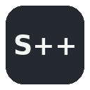
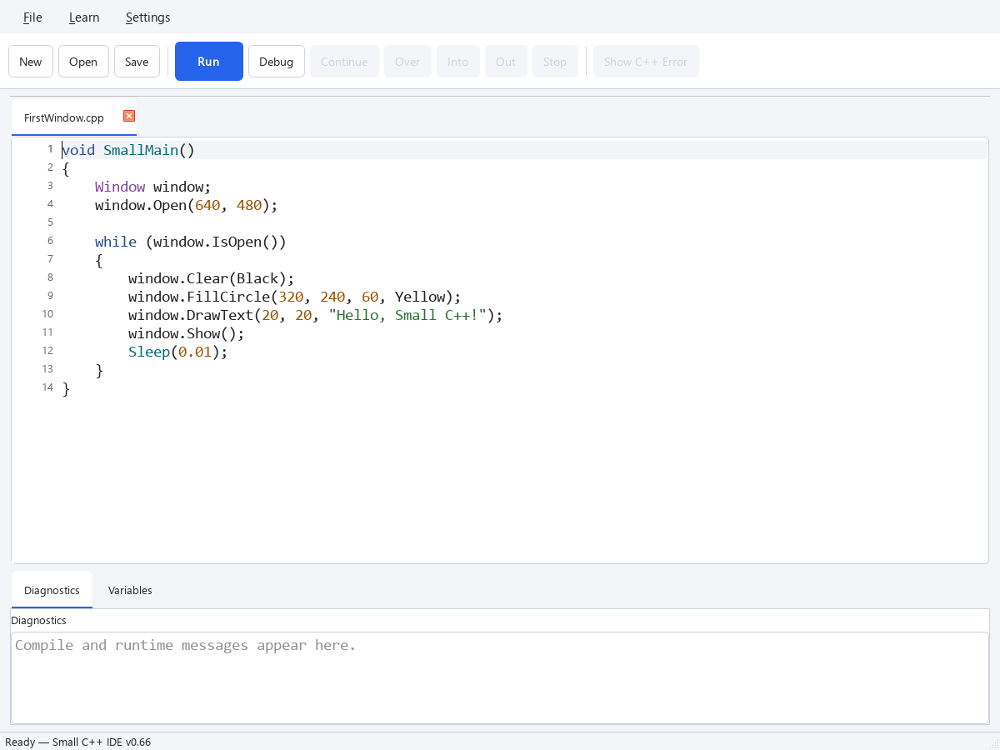

<div align="center">
  

# Small C++

**Start small. Grow as far as you want.**

A native desktop environment for learning real C++, one small step at a time.

[Project website](https://sodomau.github.io/small-cpp/) · [Getting started](docs/GETTING_STARTED.md) · [97 bilingual lessons](docs/TUTORIAL_ENGLISH.md) · [Build from source](docs/DEVELOPMENT.md) · [MIT license](LICENSE)

</div>

Small C++ helps beginners write and run their first programs with a small,
readable API. As they grow, they use the same C++ syntax, types, standard
library, and tools in larger programs.

Small C++은 실제 C++을 작은 단계로 배우는 네이티브 교육 환경입니다.
설정의 복잡함은 줄이고, 배운 내용을 일반 C++로 이어갈 수 있도록 설계했습니다.
현재 핵심 튜토리얼은 **97개 레슨을 한국어와 영어로** 제공합니다.

## Why “Small C++”?

Sunghyun Cho, POSTECH, first discovered programming through **GW-BASIC** as a
child. Small C++ brings that immediacy to learning real C++. Its name is a nod
to **Small Basic**. Read the [design and origin story](docs/DESIGN.md).

**The immediacy of BASIC. The path to C++.**

## IDE preview

<picture>
  <source media="(prefers-color-scheme: dark)" srcset="docs/images/ide-dark.png" />
  
</picture>

The native Qt IDE in [Light](docs/images/ide-light.png) and
[Dark](docs/images/ide-dark.png). The preview follows your preferred color scheme.

## Your first program

```cpp
void small_main()
{
    print("Hello, Small C++!");
}
```

Open the IDE, enter the code, and press **Run** or **F5**. Small provides the
entry point and build setup so you can start with the program itself.

Try a window next:

```cpp
void small_main()
{
    Window window;
    window.open(640, 480);

    while (window.is_open())
    {
        window.clear(Black);
        window.fill_circle(320, 240, 60, Yellow);
        window.show();
        sleep(0.01);
    }
}
```

## What you can do

- **Write and run C++:** independent file tabs, syntax highlighting, and readable diagnostics.
- **Explore graphics and input:** windows, drawing, keyboard and mouse input, sound, files, and timers.
- **Learn inside the IDE:** tutorials, runnable examples, API reference, exercises, and solutions.
- **Debug your programs:** breakpoints, stepping, and a Variables view backed by GDB.
- **Make it yours:** Light/Dark themes across the IDE and Learn windows, plus external `.qss` styles.
- **Extend outward:** the Image extension adds image creation, pixel editing, loading, and saving.

## Get started

Try the [current Windows preview](https://github.com/sodomau/small-cpp/releases/tag/v0.76.15):
use **SmallCpp-v0.76.15-Windows-x64-Setup.exe** for installation and Start menu
shortcuts, or extract **SmallCpp-v0.76.15-Windows-x64.zip** and launch
`SmallCppIDE.exe` for portable use. Both include the compiler and debugger.
See [Windows installation](docs/WINDOWS_INSTALLATION.md) for saving, updating,
and uninstalling.

The preview and current tutorials use the snake_case API. Older programs need
their PascalCase function names updated. See
[naming conventions and migration](docs/NAMING_CONVENTIONS.md).

The documented development setup is **Windows with a matching Qt MinGW
64-bit kit with KDE Frameworks**. The current workflow uses Qt 6.11.1,
KTextEditor 6.30.0, MinGW 14.2.0, CMake, and Ninja.
See [the build instructions](docs/DEVELOPMENT.md#windows-build) for the
complete setup, build, and test commands. Configure from `ide/` and keep
build output under `build/`.

After building, launch `build/local-debug/bin/Debug/SmallCppIDE.exe`.
Choose **Learn → Tutorial...** to open the lessons, or **Learn → Examples...**
to try a program. Use **Settings → Theme** to switch themes or load a QSS file.

The portable packaging workflow can bundle the compiler and runtime for
learners. Before publishing a binary release, complete the
[release checks](docs/RELEASE_CHECKLIST.md) and
[third-party license preparation](THIRD_PARTY_NOTICES.md).

## Learn and teach

| Resource | Start here |
| --- | --- |
| First use | [Getting started](docs/GETTING_STARTED.md) |
| English curriculum | [97-lesson index](docs/TUTORIAL_ENGLISH.md) |
| Korean curriculum | [97-lesson contents](https://sodomau.github.io/small-cpp/lessons/ko/index.html) |
| Teaching | [Teacher notes](docs/tutorial-small-steps/TEACHER.md) |
| Programming model | [Small C++ guide](docs/SMALL_CPP_GUIDE.md) |
| API naming | [Naming conventions](docs/NAMING_CONVENTIONS.md) |
| Design principles | [Philosophy](docs/PHILOSOPHY.md) |
| Extensions and lessons | [Authoring guide](docs/EXTENSIONS_AND_TUTORIALS.md) |

The source lesson pack provides all 97 core lessons and three Image lessons
in Korean and English. Choose **Settings → Tutorial Language → English**.
See the [English lesson index](docs/TUTORIAL_ENGLISH.md). Korean remains the
default; unavailable languages fall back to it. IDE controls use English.

## Develop and contribute

Bug reports, documentation improvements, lesson feedback, and focused fixes
are welcome through [Issues](https://github.com/sodomau/small-cpp/issues) and
pull requests. For a bug report, include the program or steps that reproduce
it, the expected result, and your Windows/Qt/toolchain versions when relevant.

Before changing code, read [AGENTS.md](AGENTS.md), the
[development workflow](docs/DEVELOPMENT.md), and the
[design philosophy](docs/PHILOSOPHY.md). Discuss major architecture changes
in an issue first. Build and run the checks appropriate to your change;
preserve the native Qt UI and the boundary between the IDE and runtime.

Find the [documentation index](docs/README.md),
[development history](docs/DEVELOPMENT_HISTORY.md), and
[archived release notes](docs/ARCHIVED_RELEASE_NOTES.md) for more detail.
Historical validation reports record results for their stated revisions;
they are not guarantees about every later build.

## License

Small-owned code, examples, tutorials, documentation, and logo/icon assets
use the [MIT License](LICENSE), except separately identified third-party
material. Copyright © 2026 Sunghyun Cho.

Qt, bundled development tools, and their dependencies retain their own
licenses. See [third-party components and release preparation](THIRD_PARTY_NOTICES.md)
for the separate obligations when distributing binaries.
