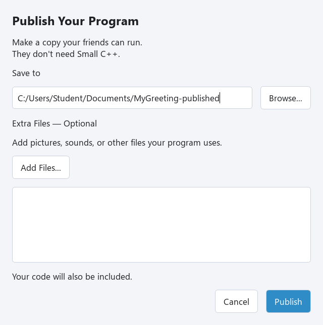

## 친구에게 보여 줄 프로그램

@code example.cpp

**Try This Code**로 열고 **MyGreeting.cpp**로 저장한 뒤 **Run**을 누르세요. 마지막 Input은 Enter를 누를 때까지 기다려서 인사말을 읽을 시간을 줍니다. 배포한 콘솔 프로그램은 할 일이 끝나면 닫힙니다. IDE에서 제공하는 자동 종료 대기는 배포본에 들어가지 않습니다.

## Windows 배포 폴더 만들기

1. **File → Publish…**를 선택하세요. **Publish Your Program** 창이 열립니다.
2. **Save to** 옆의 **Browse…**로 새 폴더를 만들 위치를 고르세요. MyGreeting-Published처럼 아직 없는 폴더 이름을 사용하세요.
3. 이 프로그램은 **Extra Files — Optional**을 비워 두고 **Publish**를 누르세요.
4. **Your program is ready!**가 나오면 **Open Folder**를 누르세요.
5. **MyGreeting.exe**를 더블 클릭하고 인사말을 읽은 뒤 Enter를 누르세요.

Publish는 내 컴퓨터에 Windows x64 배포본을 만듭니다. 인터넷에 올리는 기능은 아닙니다. 친구는 Small C++, Qt, 컴파일러를 설치하지 않아도 실행할 수 있습니다. 폴더에는 소스 코드도 들어가므로 친구가 어떻게 만들었는지 읽어 볼 수 있어요.

## Exercise — 나만의 인사말

친구에게 전할 말로 인사말을 바꾸세요. MyGreeting.cpp로 저장하고 새 폴더에 배포하세요. 새 MyGreeting.exe를 실행해서 바꾼 인사말이 나오는지 확인하세요.

@exercise exercise_starter.cpp

### Hint

Print의 큰따옴표 안을 바꾸고 마지막 Input은 남겨 두세요. Publish할 때마다 새 대상 폴더가 필요합니다. 기존 폴더를 덮어쓰지 않습니다.

@solution exercise_solution.cpp
