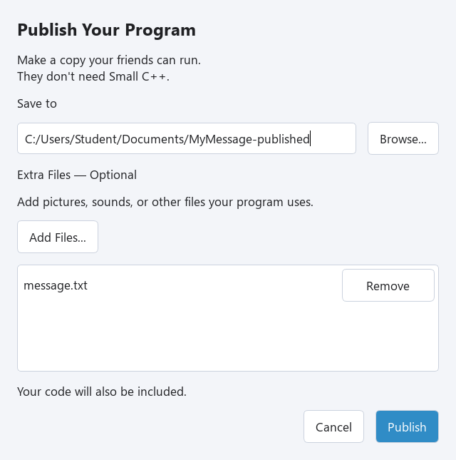

## Files your program reads

Pictures, sounds, and data are separate files when your code loads them by filename. Publish cannot guess which files you need; choose them yourself.

@code example.cpp

Create a plain text file named **message.txt**, containing one line: Hello from a file! Save it beside your saved MyMessage.cpp, then run the program. If you need help making the text file, use the text-file lessons in Small Steps IV. Check that the name is message.txt, not message.txt.txt.

## Add the file to the package

1. Choose **File → Publish…** and a new destination folder.
2. Under **Extra Files — Optional**, press **Add Files…** and select message.txt.
3. Check the list. Use **Remove** if you added the wrong file. You can press **Add Files…** again to add more files.
4. Press **Publish**, then **Open Folder**. Both MyMessage.exe and message.txt should be in that folder.
5. Double-click MyMessage.exe. Check that it reads your line from the file.

Selected files are copied beside the exe. Use simple English filenames such as picture.png or music.wav, matching your code exactly. This version handles files at that same level; keep resource filenames flat rather than using subfolders. Two files with the same name cannot both be added.

## Exercise — A second message

Create a second one-line text file named friend.txt beside your source. Change the program to read friend.txt, save it, and publish with friend.txt selected. Test the exe in the published folder.

@exercise exercise_starter.cpp

### Hint

Change the name in file.open. Changing the code alone does not copy the file: select friend.txt with Add Files too. The same steps work for pictures and sounds your program loads.

@solution exercise_solution.cpp
