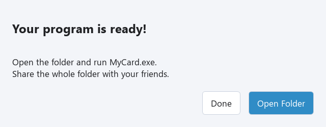

## 작은 인사 카드 만들기

@code example.cpp

MyCard.cpp로 저장하세요. 실행해 본 뒤 새 폴더에 배포하세요. 앞 수업에서 완성한 다른 프로그램을 사용해도 좋습니다.

## 보내기 전에 확인하기

배포 폴더를 열고 MyCard.exe를 더블 클릭해서 결과를 확인하세요. 추가 파일을 쓰는 프로그램이라면 그것도 확인하세요. Publish가 만든 DLL 파일과 플러그인, licenses 폴더 등은 모두 함께 두세요. 원본 소스코드와 재링크 자료는 자동으로 포함되지 않습니다. 공유하려고 배포 파일들을 열거나 고칠 필요는 없습니다.

**exe만 보내지 말고 폴더 전체를 보내세요.** 나머지 파일은 실행에 필요하거나 라이브러리의 라이선스와 소스를 구하는 방법을 담고 있습니다. 그림과 소리 등은 내가 공유할 수 있는 자료만 넣으세요.

## ZIP으로 묶기

1. 실행 중인 프로그램을 닫으세요.
2. 파일 탐색기에서 배포 폴더의 상위 폴더로 이동하세요.
3. 배포 폴더 전체를 오른쪽 클릭하고 ZIP으로 압축하는 항목을 선택하세요. Windows 버전에 따라 **Compress to ZIP file** 또는 **Send to → Compressed (zipped) folder** 등으로 표시됩니다.
4. 평소 사용하는 파일 공유 방법으로 ZIP을 친구에게 보내세요. 일부 서비스는 ZIP 안에 있는 실행 파일도 막습니다. 학교나 가정에서 허용하는 공유 방법을 사용하세요.

친구는 ZIP을 저장하고 **Extract All…**에 해당하는 압축 풀기를 선택한 뒤, 풀린 폴더를 열어 exe를 더블 클릭하면 됩니다. ZIP 안에서 바로 실행하지 마세요. 배포본은 Windows x64용이며 휴대폰이나 Mac용은 아닙니다. 친구에게 Small C++ 설치는 필요하지 않습니다.

## Exercise — 친구가 받을 파일 확인하기

아래 카드를 나만의 메시지로 바꾸고 배포하세요. ZIP으로 묶고 다른 폴더에 압축을 풀어 그 안의 exe를 실행하세요. 가능하면 다른 Windows x64 컴퓨터에서도 실행해 보세요. 이름과 메시지, 추가 파일이 모두 맞는지 확인한 뒤 보내세요.

@exercise exercise_starter.cpp

### Hint

Print의 문자열을 바꾸세요. 카드를 읽을 수 있도록 Input은 남겨 두세요. 아래 풀이는 카드의 한 예입니다. 중요한 것은 압축을 푼 배포본 전체가 잘 실행되는지 확인하는 것입니다.

@solution exercise_solution.cpp
