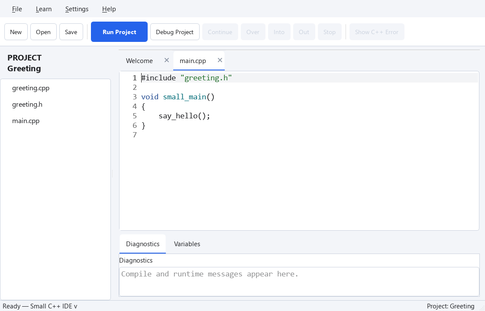

## 소개를 한 곳에 모으기

앞 수업에서는 `main.cpp`에 함수 선언을 직접 썼습니다. 여러 파일에서 같은 함수를 쓸 때는 선언을 헤더에 모아 두면 편합니다.

왼쪽 빈 공간을 우클릭해 **New Header File…**로 `greeting.h`를 만드세요. 처음 들어 있는 `#pragma once`는 그대로 둡니다.

### greeting.h
```cpp
#pragma once

void SayHello();
```

### greeting.cpp
```cpp
#include "greeting.h"

void SayHello()
{
    Print("Hello from another file!");
}
```

### main.cpp
```cpp
#include "greeting.h"

void SmallMain()
{
    SayHello();
}
```

`#include "greeting.h"`는 이 헤더의 내용을 현재 파일에서 읽게 합니다. 같은 폴더의 헤더 이름은 큰따옴표로 감쌉니다. 함수 내용은 `greeting.cpp` 한 곳에만 있습니다. 그 파일도 자기 헤더를 포함해 선언과 정의가 맞는지 확인합니다.

`#pragma once`는 한 소스 파일을 컴파일할 때 헤더 내용이 중복으로 들어오는 것을 막습니다. C++ 표준 기능은 아니지만 Small C++의 컴파일러가 지원합니다. 다른 표준적인 방법인 include guard는 나중에 배워도 됩니다.

## 한 파일에서 다시 확인하기



아래는 같은 동작을 한 파일로 모은 코드입니다. **Try This Code**는 이 한 파일을 엽니다. 프로젝트의 세 파일을 자동으로 만들지는 않습니다.

@code example.cpp

## 연습 — 직접 확인하기

한 파일 연습에서 SayHello를 두 번 호출하세요. 그 다음 프로젝트에서도 main.cpp만 바꿔 같은 결과를 만들어 보세요.

@exercise exercise_starter.cpp

### Hint

위에서 설명한 메뉴를 이용하세요. 아래 코드는 한 파일 연습의 답안입니다. 프로젝트에서는 해당 역할의 파일에 같은 변경을 적용하세요.

@solution exercise_solution.cpp
