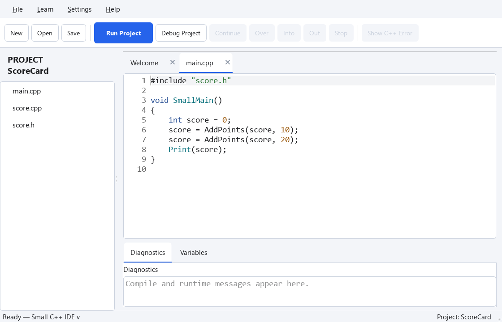

## 점수 계산을 분리하기

파일 이름은 역할을 설명하면 좋습니다. 새로운 `ScoreCard` 프로젝트를 만들고 `main.cpp`, `score.h`, `score.cpp`를 같은 폴더에 둡니다. 아래 코드로 각각 바꿔 보세요.

### score.h
```cpp
#pragma once

int AddPoints(int score, int points);
```

### score.cpp
```cpp
#include "score.h"

int AddPoints(int score, int points)
{
    return score + points;
}
```

### main.cpp
```cpp
#include "score.h"

void SmallMain()
{
    int score = 0;
    score = AddPoints(score, 10);
    score = AddPoints(score, 20);
    Print(score);
}
```

**Run Project**를 누르면 `30`이 나옵니다. `main.cpp`는 프로그램의 흐름을 정하고, `score.cpp`는 점수 계산을 맡습니다. 점수는 main의 지역변수입니다. 함수에 값을 전달하고 새 값을 돌려받으므로 공유 전역변수가 필요 없습니다.

처음에는 **소스 파일과 같은 이름의 헤더**를 짝으로 만드세요. 필요한 함수 선언은 헤더에, 함수 정의는 소스에 둡니다. 한 파일로 충분한 작은 함수마다 파일을 만들 필요는 없습니다.

## 한 파일로 동작 확인하기



@code example.cpp

## 연습 — 직접 확인하기

한 파일 연습에 5점을 더하는 호출을 추가해 35를 출력하세요. 다음으로 프로젝트의 main.cpp에도 같은 호출을 추가하세요. score.h와 score.cpp는 바꿀 필요가 있을까요?

@exercise exercise_starter.cpp

### Hint

위에서 설명한 메뉴를 이용하세요. 아래 코드는 한 파일 연습의 답안입니다. 프로젝트에서는 해당 역할의 파일에 같은 변경을 적용하세요.

@solution exercise_solution.cpp
